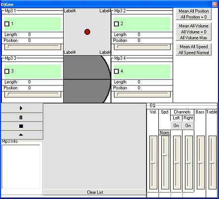



## DjGee \- simple dj program

### Description

quad mp3s in pure mci, quad-fader, simple mixer, speed adjustment, !scratching!...nothing too hard...VOTE plz. and i'd like to thank everyone that submits to planet-source-code.com, without you i wouldnt have been able to do this. This is a work in progress, so if you make revisions to my code, besides skinning it, then tell me what you did.
 
### More Info
 

             |
---                |---
**Submitted On**   |2003-03-13 00:06:54
**By**             |[George E\.](https://github.com/Planet-Source-Code/PSCIndex/blob/master/ByAuthor/george-e.md)
**Level**          |Intermediate
**User Rating**    |4.8 (38 globes from 8 users)
**Compatibility**  |VB 6\.0
**Category**       |[Sound/MP3](https://github.com/Planet-Source-Code/PSCIndex/blob/master/ByCategory/sound-mp3__1-45.md)
**World**          |[Visual Basic](https://github.com/Planet-Source-Code/PSCIndex/blob/master/ByWorld/visual-basic.md)
**Archive File**   |[DjGee\_\-\_si1558523132003\.zip](https://github.com/Planet-Source-Code/george-e-djgee-simple-dj-program__1-43967/archive/master.zip)

